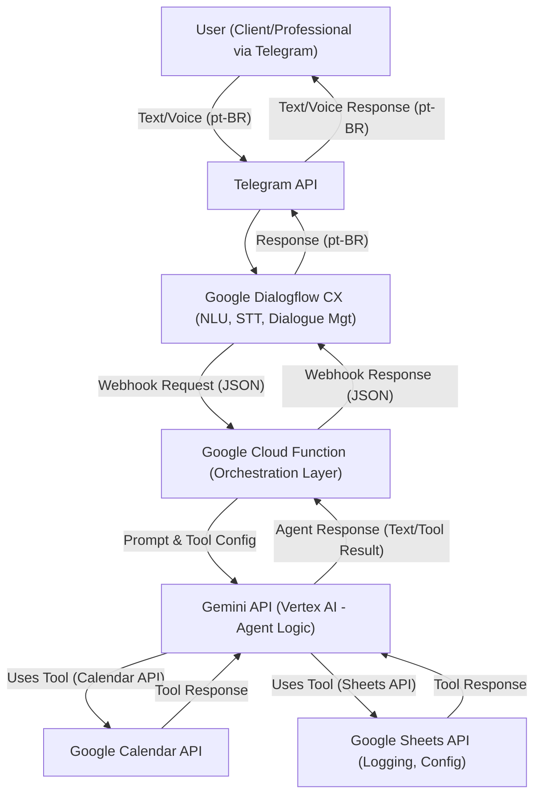
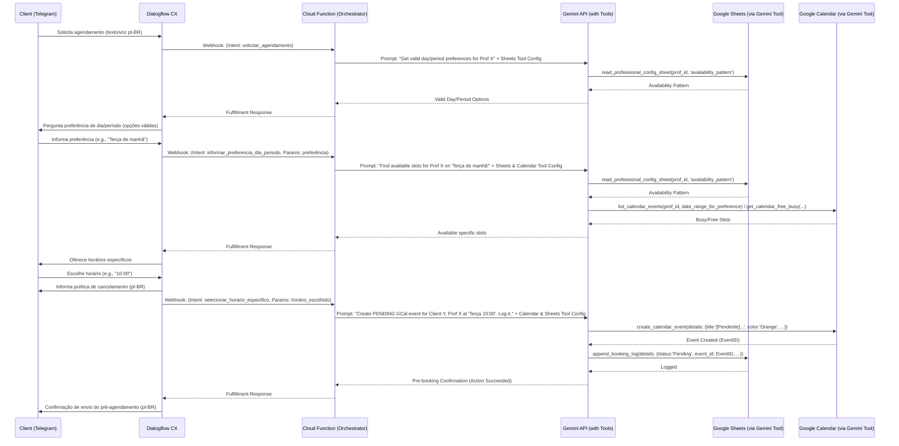
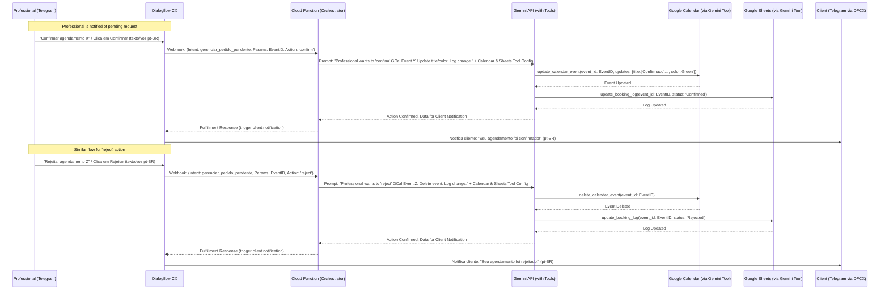

# Technical Specification: AgendAI - P1 (MVP)

**Version:** 1.5
**Date:** May 17, 2025
**Project:** AgendAI
**Author:** Gemini (based on user interactions and PRD v1.6)

## 1. Introduction

This document outlines the technical design and implementation details for the P1 (MVP Essential) features of the AgendAI project. AgendAI is an intelligent virtual assistant for automating appointment scheduling. It leverages Google Dialogflow CX for conversation management, the Gemini API (via Vertex AI) as its core intelligent agent capable of using tools, and Google Cloud Functions (Python) as an orchestration layer. The tools utilized by Gemini will include Google Calendar and Google Sheets APIs.

The P1 features focus on establishing the core scheduling lifecycle: professional availability setup, cancellation policy setup, client pre-booking requests (with voice/text input), professional confirmation/rejection, calendar updates, and basic agenda querying.

This specification adheres to the "Style Guide and Coding Conventions: AgendAI (Version 1.7)".

**Supported Language:** The primary language for all user interactions with AgendAI (including input via STT and chatbot responses) is **Brazilian Portuguese (pt-BR)**.

## 2. System Architecture Overview (P1)

The P1 system will consist of the following core components:

1.  **Client Interface (Telegram Bot):** Users (Professionals and Clients) interact with AgendAI via a Telegram bot.
2.  **Google Dialogflow CX:** Handles Natural Language Understanding (NLU) in pt-BR, Speech-to-Text (STT) integration for pt-BR, dialogue management, and state tracking. It will make webhook calls to Google Cloud Functions.
3.  **Google Cloud Functions (Python Runtime):** Serves as an orchestration layer. These functions will:
    * Receive webhook requests from Dialogflow CX.
    * Prepare prompts and context for the Gemini API.
    * Call the Gemini API, specifying available tools (Google Calendar, Google Sheets) and function declarations for these tools.
    * Process the response from Gemini, which may include results from tool calls or requests to execute tool functions.
    * If Gemini requests a tool function execution, the Cloud Function will make the necessary direct API call (e.g. to Google Calendar/Sheets) *only if* Gemini's native tool integration isn't sufficient or direct control is needed for complex operations not covered by simple tool schema. **Primary approach: Gemini uses its declared tools directly.**
    * Format the final response from Gemini (or from direct tool calls if absolutely necessary) to send back to Dialogflow CX.
4.  **Gemini API (via Vertex AI):** Acts as the core intelligent agent. It will:
    * Understand user requests based on prompts from the Cloud Function.
    * Determine when to use available tools (Google Calendar, Google Sheets) to fulfill requests.
    * Formulate responses based on information retrieved or actions performed by its tools.
    * Natively call Google Calendar and Google Sheets APIs via its configured tool interface, based on function declarations provided.
5.  **Google Calendar API:** Accessed as a tool by the Gemini model for managing availability and appointments.
6.  **Google Sheets API:** Accessed as a tool by the Gemini model for logging interactions and retrieving/storing configurations.
7.  **Google Cloud Speech-to-Text (STT) API:** Integrated with Dialogflow CX to transcribe voice input from users in pt-BR.

**High-Level Interaction Flow (Example: Client Booking):**
Client (Voice/Text in pt-BR on Telegram) -> Telegram API -> Dialogflow CX (STT, NLU, Dialogue Mgt) -> Webhook -> Google Cloud Function (Prepare Prompt) -> Gemini API (Process Prompt, Use Calendar/Sheets Tools) -> [Optional: Gemini requests specific data via function call if tool use is indirect, Cloud Function executes, returns to Gemini] -> Gemini API Response (Result of tool use/action) -> Google Cloud Function (Format Response) -> Dialogflow CX -> Telegram API -> Client (Response in pt-BR).

## 3. Mermaid Diagrams (P1 Flows)

### 3.1 High-Level System Architecture (Gemini Tool Use)

### 3.2 Client Pre-Booking Request Flow (P1.3 Simplified - Gemini Tool Use)

### 3.3 Professional Confirmation/Rejection Flow (P1.4 & P1.5 Simplified - Gemini Tool Use)

## 4. Detailed Design for P1 Functionalities
All Google Cloud Functions will be written in Python. Pydantic models will be used for validating webhook request/response payloads from Dialogflow CX and for structuring data passed to/from the Gemini API. Chatbot example messages are in Brazilian Portuguese (pt-BR).

**General Cloud Function Workflow for P1 Features:**
1.  Receive Dialogflow CX webhook request.
2.  Extract intent, parameters, and relevant session information.
3.  Construct a detailed prompt for the Gemini API, outlining the task and providing necessary context (e.g., user ID, professional ID, conversation history snippets if relevant).
4.  Define function declarations for the tools Gemini can use (e.g., `get_calendar_events`, `create_calendar_event`, `update_sheet_row`, `read_sheet_config`).
5.  Call the Gemini API (`generateContent` or similar, with tool configurations).
6.  Process Gemini's response:
    * If it's a direct textual answer, format it for Dialogflow.
    * If it includes a `functionCall` (Gemini indicating it wants to use a tool), the Cloud Function might execute this *if* the tool use isn't fully native/direct from Gemini's side, or if complex pre/post processing for the tool is needed. **The primary goal is for Gemini to use tools as directly as possible.** For P1, we assume Gemini can make most Calendar/Sheet modifications directly via its tool configuration.
    * If Gemini used a tool and provides the result, format this result for Dialogflow.
7.  Return a structured JSON response to Dialogflow CX for fulfillment.

---

### P1.1: Professional's Initial Availability Setup
*(PRD Ref: P1, Funcionalidade 1)*

* **Dialogflow CX Design:** (As per Tech Spec v1.4)
    * Intent: `configurar_disponibilidade`. Parameters: `dias_semana`, `horario_inicio`, `horario_fim`, etc.
* **Google Cloud Function (`handle_professional_setup` or similar, routing based on intent):**
    * **Input:** Dialogflow webhook with availability parameters.
    * **Processing:**
        1.  Validate input.
        2.  Prepare prompt for Gemini: "The professional \[ProfID\] wants to set their availability. Days: \[dias_semana\], Start: \[horario_inicio\], End: \[horario_fim\], Lunch: \[...]. Please store this availability pattern."
        3.  Declare `update_professional_config_sheet` tool for Gemini.
        4.  Call Gemini API. Gemini should use the tool to update the "Professional_Config" Google Sheet.
    * **Output:** Dialogflow webhook response based on Gemini's confirmation (e.g., "Ótimo! Sua disponibilidade foi configurada com sucesso. ✨").
* **Gemini Tool (Google Sheets):** `update_professional_config_sheet(professional_id, availability_pattern_json)` - Gemini calls this tool to write to the "Professional_Config" sheet.
* **STT:** For professional's voice input in pt-BR.

---

### P1.2: Professional's Cancellation Policy Setup
*(PRD Ref: P1, Funcionalidade 2)*

* **Dialogflow CX Design:** (As per Tech Spec v1.4)
    * Intent: `configurar_politica_cancelamento`. Parameters: `limite_cancelamento_horas`, `taxa_cancelamento_valor`, etc.
* **Google Cloud Function (`handle_professional_setup`):**
    * **Input:** Dialogflow webhook with policy parameters.
    * **Processing:**
        1.  Validate input.
        2.  Prepare prompt for Gemini: "The professional \[ProfID\] wants to set their cancellation policy. Limit: \[limite_cancelamento_horas\] hours, Fee: \[taxa_cancelamento_valor\] \[moeda\]. Please store this policy."
        3.  Declare `update_professional_config_sheet` tool for Gemini (can be the same tool as P1.1, just updating different columns/data).
        4.  Call Gemini API. Gemini uses the tool to update the "Professional_Config" Google Sheet.
    * **Output:** Dialogflow webhook response based on Gemini's confirmation.
* **Gemini Tool (Google Sheets):** `update_professional_config_sheet(professional_id, cancellation_policy_data)`
* **STT:** For professional's voice input in pt-BR.

---

### P1.3: Client's Pre-Booking Request
*(PRD Ref: P1, Funcionalidade 3)*

* **Dialogflow CX Design:** (As per Tech Spec v1.4 - collects preferences, offers slots, informs policy)
* **Google Cloud Function (`handle_client_booking` - multiple steps orchestrated via Dialogflow session parameters or separate function calls for clarity):**
    * **Step 1: Get Valid Preference Options:**
        * Prompt to Gemini: "For professional \[ProfID\], what are the valid general day/period preferences for booking, based on their configured availability pattern?"
        * Gemini Tool (Sheets): `read_professional_config_sheet(professional_id, config_key='availability_pattern')`.
        * Gemini processes pattern and suggests valid preference options (e.g., "Segundas à tarde", "Terças de manhã").
    * **Step 2: Find Available Slots:**
        * After client gives preference (e.g., "Terça de manhã").
        * Prompt to Gemini: "Client \[ClientID\] wants to book with professional \[ProfID\] on \[preferred_day_period\]. Check Google Calendar for specific available slots of \[service_duration, e.g., 1 hour\] on that day/period, considering the professional's base availability and existing appointments."
        * Gemini Tools (Sheets & Calendar):
            * `read_professional_config_sheet(professional_id, config_key='availability_pattern')`.
            * `get_calendar_free_busy(professional_id, date_range_for_preference)`.
            * `list_calendar_events(professional_id, date_range_for_preference)`.
        * Gemini cross-references and returns list of specific slots.
    * **Step 3: Create Pending Appointment:**
        * After client selects a slot and is informed of cancellation policy.
        * Prompt to Gemini: "Client \[ClientID\] has selected slot \[selected_datetime_iso\] for service '\[ServiceName\]' with professional \[ProfID\]. Create a PENDING appointment in the professional's Google Calendar. Title: '\[Pendente\] - \[ServiceName\]', Color: Orange. Add client \[ClientID/email\] as attendee. Log this pre-booking."
        * Gemini Tools (Calendar & Sheets):
            * `create_calendar_event(professional_id, event_details={title, start, end, color, attendees})`.
            * `append_booking_log(log_details={...status: 'Pending', calendar_event_id})`.
    * **Output (for each step):** Dialogflow webhook response based on Gemini's output/confirmation.
* **STT:** For client's voice input in pt-BR.

---

### P1.4: Professional's Pre-Booking Management (Confirmation/Rejection)
*(PRD Ref: P1, Funcionalidade 4)*

* **Dialogflow CX Design:** (As per Tech Spec v1.4)
* **Google Cloud Function (`handle_professional_actions`):**
    * **Input:** Dialogflow webhook with `calendar_event_id`, `action` (confirm/reject).
    * **Processing:**
        1.  Validate input.
        2.  Prompt to Gemini: "Professional \[ProfID\] wants to \[action: 'confirm'/'reject'\] the appointment with Calendar Event ID: \[calendar_event_id\]. If confirming, update title to '\[Confirmado\] - {ServiceName}' and color to Green. If rejecting, delete the event. Update the booking log accordingly."
        3.  Gemini Tools (Calendar & Sheets):
            * `get_calendar_event_details(calendar_event_id)` (to get service name for title).
            * `update_calendar_event(calendar_event_id, updates={title, color})` OR `delete_calendar_event(calendar_event_id)`.
            * `update_booking_log(calendar_event_id, new_status)`
    * **Output:** Dialogflow webhook response based on Gemini's action confirmation, triggering client notification.
* **STT:** For professional's voice commands in pt-BR.

---

### P1.5: Update Agenda & Notify Client of Outcome
*(PRD Ref: P1, Funcionalidade 5)*

* **Dialogflow CX Design:** (As per Tech Spec v1.4 - triggered by backend after P1.4)
* **Google Cloud Function (part of `handle_professional_actions` response or separate `notify_client_of_outcome`):**
    * **Processing:** Based on Gemini's action in P1.4, prepare a notification message.
    * Prompt to Gemini (optional, if dynamic message needed): "The appointment \[calendar_event_id\] for client \[ClientID\] was just \[confirmed/rejected\]. Craft a suitable notification message for the client."
    * **Output:** Formatted message for Dialogflow to send to the client.
* **Gemini:** Can be used for crafting these pt-BR messages.

---

### P1.6: Professional's Simple Agenda Query
*(PRD Ref: P1, Funcionalidade 6)*

* **Dialogflow CX Design:** (As per Tech Spec v1.4)
* **Google Cloud Function (`handle_professional_queries`):**
    * **Input:** Dialogflow webhook with `date_period`.
    * **Processing:**
        1.  Parse `date_period`.
        2.  Prompt to Gemini: "Professional \[ProfID\] wants to see their agenda for \[parsed_date_period\]. List all appointments from their Google Calendar for this period, indicating if they are 'Pendente' or 'Confirmado'."
        3.  Gemini Tool (Calendar): `list_calendar_events(professional_id, date_range, include_details=True)`.
        4.  Gemini processes the event list and formats a summary.
    * **Output:** Dialogflow webhook response with the agenda summary from Gemini.
* **STT:** For professional's query in pt-BR.

---

## 5. Data Models (P1 Specific)

* **Pydantic Models (Python - Cloud Functions):**
    * `DialogflowWebhookRequest`: Generic structure for incoming requests from Dialogflow.
    * `GeminiToolCallRequest`/`GeminiToolCallResponse`: Structures for interacting with Gemini if it requests function execution by the Cloud Function (less preferred, aim for direct tool use by Gemini).
    * `ProfessionalConfig`: Pydantic model for data in "Professional_Config" sheet.
    * `BookingLogEntry`: Pydantic model for data in "Booking_Logs" sheet.
    * `CalendarEventData`: Pydantic model for structuring calendar event details for Gemini tools.
    * `DialogflowWebhookResponse`: Structure for responses to Dialogflow.
* **Google Sheets ("Professional_Config" Sheet):**
    * Columns: `ProfessionalID` (Text), `AvailabilityPatternJSON` (Text), `CancellationLimitHours` (Number), `CancellationFeeAmount` (Number), `Currency` (Text).
* **Google Sheets ("Booking_Logs" Sheet):**
    * Columns: `Timestamp` (DateTime), `LogID` (Text, UUID), `ClientID` (Text), `ProfessionalID` (Text), `RequestedSlot_StartTime` (DateTime), `RequestedSlot_EndTime` (DateTime), `Service` (Text), `Status` (Text: Pending, Confirmed, Rejected, Cancelled_Client, Cancelled_Policy_Fee_Applicable), `CalendarEventID` (Text), `ClientNotifiedTimestamp` (DateTime), `CancellationFeeApplied` (Boolean).
* **Google Calendar Event Structure (as created/managed by Gemini tool):**
    * **Owner:** Professional's Google Account.
    * **Attendees:** `[{ "email": "professional_email" }, { "email": "client_email", "responseStatus": "needsAction" / "accepted" }]`
    * **Title:** `[Pendente] - {NomeDoServico}` or `[Confirmado] - {NomeDoServico}`.
    * **ColorId:** (e.g., Orange, Green - Gemini tool needs to map these).
    * **Description:** "Agendado via AgendAI. Cliente: \[Nome/ID do Cliente\]. Solicitação: \[Timestamp\]."
    * **Timezone:** (e.g., `America/Sao_Paulo`).

**Function Declarations for Gemini Tools (Conceptual):**
These define the "signature" of tools Gemini can use. The actual implementation of how Gemini calls these (natively via API or via function calling back to Cloud Function) depends on the Gemini API version and Vertex AI capabilities.

* `update_professional_config_sheet(professional_id: str, config_data: dict)`
* `read_professional_config_sheet(professional_id: str, config_key: str) -> dict`
* `get_calendar_free_busy(professional_id: str, start_time_iso: str, end_time_iso: str) -> list_of_busy_slots`
* `list_calendar_events(professional_id: str, start_time_iso: str, end_time_iso: str, query: Optional[str]=None) -> list_of_events`
* `create_calendar_event(professional_id: str, event_title: str, start_time_iso: str, end_time_iso: str, attendees: list = [], color: str = None, description: str = None) -> event_id`
* `update_calendar_event(calendar_event_id: str, updates: dict) -> event_id`
* `delete_calendar_event(calendar_event_id: str) -> bool`
* `append_booking_log(log_entry: dict)`
* `update_booking_log(identifier_key: str, identifier_value: str, updates: dict)`

## 6. Authentication and Authorization

* **Google Cloud Functions to Gemini API (Vertex AI):**
    * The Cloud Function will use its default service account identity, which needs IAM roles like "Vertex AI User" to call the Gemini API.
* **Gemini API (acting as Agent) to Google Calendar/Sheets APIs (via Tools):**
    * This is the critical part. The Gemini model, when configured with tools for Google Calendar/Sheets, will effectively act on behalf of the user (the professional).
    * **OAuth 2.0 Consent Flow:** The professional must grant AgendAI (represented by an OAuth Client ID configured for the project/tools) permission to access their Google Calendar and Google Sheets data. This is a one-time setup for the professional.
    * **Token Management:** Refresh tokens obtained from the OAuth flow must be securely stored (e.g., Firestore, Google Secret Manager) and associated with the professional's ID. These tokens will be used by the Gemini tool integration (or the Cloud Function if it's making calls on Gemini's behalf after a function call from Gemini) to make authenticated API calls.
* **Dialogflow CX to Cloud Functions:** Secure webhook calls (e.g., using authentication headers or IAM for invoker if functions are private).

## 7. Error Handling Strategy (P1)

* **Cloud Functions:**
    * Validate all incoming webhook payloads from Dialogflow CX.
    * Use `try-except` blocks for calls to the Gemini API.
    * Handle errors returned by the Gemini API (e.g., prompt too long, tool use failure, permission issues).
    * If Gemini reports a tool execution error (e.g., Calendar API permission denied), this needs to be surfaced appropriately.
    * Log errors to Google Cloud Logging.
    * Return structured error responses to Dialogflow CX for user-facing messages in pt-BR.
* **Dialogflow CX:**
    * Design "no-match" reprompts and error handling flows for when user input is not understood or when webhooks (to Cloud Functions) fail or return errors.
* **Gemini Tool Use:** Errors during tool execution by Gemini (e.g., invalid parameters passed to a Calendar tool function) should be handled by Gemini, which then formulates an appropriate response or error indication. The Cloud Function should log Gemini's full response, including any tool error details.

## 8. Logging Strategy (P1)

* **Google Sheets ("Booking_Logs"):** As defined in Data Models.
* **Google Cloud Logging:**
    * All Cloud Function invocations.
    * Key input parameters received from Dialogflow.
    * **Prompts sent to Gemini API.**
    * **Full responses received from Gemini API (including any `functionCall` or `tool_code_output`).**
    * Errors encountered during Cloud Function processing or Gemini API calls.
    * Structured logs (JSON) are preferred.

## 9. Deployment Considerations (P1)

* **Dialogflow CX Agent:** Versioned, language pt-BR. Webhooks configured to point to deployed Cloud Functions.
* **Google Cloud Functions:** Deployed. Environment variables set for Gemini API endpoint, Project ID, Sheet IDs, etc.
* **Gemini API (Vertex AI):** Model selected (e.g., Gemini Pro). Tools (Google Calendar, Google Sheets) configured with appropriate function declarations and authentication (OAuth Client ID for user data access).
* **Google Sheets:** Created with correct structure and shared appropriately if needed for service account access (though user OAuth is preferred for user data).
* **API Enablement:** Dialogflow, Cloud Functions, Vertex AI, Calendar, Sheets, STT APIs enabled.
* **OAuth Consent Screen:** Configured for the project, detailing permissions requested for Calendar and Sheets.

## 10. Assumptions and Dependencies (P1)

* Professional has a Google Account and grants OAuth consent for Calendar/Sheets access by AgendAI tools.
* Clients interact via Telegram.
* Gemini API supports robust tool use for Google Calendar and Google Sheets with the necessary granularity for P1 features.
* Availability of clear function declarations for Gemini tools.
* Internet connectivity.
* Users interact in Brazilian Portuguese.

## 11. Test Scenarios (P1)

This section outlines test scenarios for the P1 functionalities.
**Format:** Scenario ID | Feature | Description | Preconditions | Steps | Expected Results

---

**P1.1: Professional's Initial Availability Setup**

* **Scenario ID:** P1.1.1
    * **Feature:** P1.1
    * **Description:** Professional successfully sets up standard weekly availability.
    * **Preconditions:** Professional is authenticated (OAuth flow completed for tool use). Interacting with AgendAI.
    * **Steps:**
        1.  Prof: "Configurar minha disponibilidade" (texto/voz).
        2.  AgendAI (pt-BR): "Olá, \[Nome do Profissional\]! Para começarmos, por favor, diga-me quais dias da semana você geralmente atende..."
        3.  Prof: "Segunda a sexta, das 9h às 18h, com almoço do meio-dia às 13h" (texto/voz).
        4.  AgendAI (pt-BR): "Perfeito. Então sua disponibilidade base é de Segunda a Sexta, das 9h às 12h e das 13h às 18h. Correto?"
        5.  Prof: "Correto" (texto/voz).
    * **Expected Results:** AgendAI responds (pt-BR): "Ótimo! Sua disponibilidade foi configurada com sucesso. ✨". Gemini, using the Sheets tool, correctly stores the availability pattern in Google Sheets ("Professional_Config").

* **Scenario ID:** P1.1.2
    * **Feature:** P1.1
    * **Description:** Professional provides an invalid time format during availability setup.
    * **Preconditions:** Professional is in the availability setup flow.
    * **Steps:**
        1.  AgendAI (pt-BR): "...E quais são os seus horários de atendimento nesses dias?"
        2.  Prof: "Das nove às dezoito" (texto/voz).
    * **Expected Results:** Dialogflow/Gemini requests clarification or a specific format (pt-BR): "Por favor, informe o horário no formato HH:MM, por exemplo, '09:00' e '18:00'."

---

**P1.2: Professional's Cancellation Policy Setup**

* **Scenario ID:** P1.2.1
    * **Feature:** P1.2
    * **Description:** Professional successfully sets up a cancellation policy.
    * **Preconditions:** Professional is authenticated.
    * **Steps:**
        1.  Prof: "Definir política de cancelamento" (texto/voz).
        2.  AgendAI (pt-BR): "Gostaria de configurar uma política de cancelamento...?"
        3.  Prof: (Follows prompts, providing "24 horas antes" and "R$ 50" for fee).
        4.  AgendAI (pt-BR): "Perfeito. Sua política de cancelamento foi configurada: cancelamentos com até 24 horas de antecedência são gratuitos. Após esse prazo, poderá ser aplicada uma taxa de R$ 50,00. Correto?"
        5.  Prof: "Sim" (texto/voz).
    * **Expected Results:** AgendAI confirms. Gemini, using the Sheets tool, stores the policy in Google Sheets ("Professional_Config").

---

**P1.3: Client's Pre-Booking Request**

* **Scenario ID:** P1.3.1 (Happy Path)
    * **Feature:** P1.3
    * **Description:** Client successfully requests a pre-booking for a valid preferred slot.
    * **Preconditions:** Professional has availability and cancellation policy configured. Client is interacting.
    * **Steps:**
        1.  Client: "Quero agendar uma consulta" (texto/voz).
        2.  AgendAI (pt-BR): (Asks for service, then day/period preference, showing valid options derived from Gemini's tool use - Sheets).
        3.  Client: "Terça de manhã" (texto/voz).
        4.  AgendAI (pt-BR): (Offers specific available slots for Tuesday morning, derived from Gemini's tool use - Sheets & Calendar).
        5.  Client: "Às 10:00" (texto/voz).
        6.  AgendAI (pt-BR): (Informs about cancellation policy).
        7.  AgendAI (pt-BR): "Excelente! Seu pedido para Terça às 10:00 foi enviado... aguarda confirmação."
    * **Expected Results:** Gemini, using the Calendar tool, creates a pending event (Orange, Title: `[Pendente] - {Serviço}`) in the Professional's Google Calendar. Gemini, using the Sheets tool, logs the pre-booking.

* **Scenario ID:** P1.3.2 (No slots available for preference)
    * **Feature:** P1.3
    * **Description:** Client requests a preference for which no slots are currently available.
    * **Preconditions:** Professional has availability. Client is interacting.
    * **Steps:**
        1.  Client: "Quero agendar para Sábado de manhã" (texto/voz).
        2.  AgendAI (pt-BR): (Gemini, using Sheets/Calendar tools, determines no availability).
    * **Expected Results:** AgendAI informs (pt-BR): "Desculpe, não encontrei horários disponíveis para Sábado de manhã. Gostaria de tentar outra preferência de dia ou período?"

* **Scenario ID:** P1.3.3 (Client informed of cancellation policy)
    * **Feature:** P1.3
    * **Description:** Verify client is informed about the cancellation policy before pre-booking is finalized.
    * **Preconditions:** Client has selected a specific slot. Professional has a cancellation policy.
    * **Steps:**
        1.  Client selects a time slot (e.g., "Terça às 10:00").
    * **Expected Results:** Before the final pre-booking confirmation, AgendAI states (pt-BR): "Importante: \[Nome do Profissional\] possui uma política de cancelamento..."

---

**P1.4 & P1.5: Professional Manages Pre-Booking & Client Notified**

* **Scenario ID:** P1.4.1 (Professional Confirms)
    * **Feature:** P1.4, P1.5
    * **Description:** Professional confirms a pending pre-booking.
    * **Preconditions:** A pre-booking exists. Professional is interacting.
    * **Steps:**
        1.  AgendAI (pt-BR): (Notifies Professional of pending request). "Deseja \[Confirmar\] ou \[Rejeitar\]?"
        2.  Prof: "Confirmar" (texto/voz).
    * **Expected Results:**
        * Gemini, using Calendar tool, updates event: Title to `[Confirmado] - {Serviço}`, Color to Green.
        * Gemini, using Sheets tool, updates log to "Confirmed".
        * Client receives notification (pt-BR) via AgendAI: "Ótima notícia, \[Nome do Cliente\]! Seu agendamento... está confirmado! ✨"

* **Scenario ID:** P1.4.2 (Professional Rejects)
    * **Feature:** P1.4, P1.5
    * **Description:** Professional rejects a pending pre-booking.
    * **Preconditions:** A pre-booking exists. Professional is interacting.
    * **Steps:**
        1.  AgendAI (pt-BR): (Notifies Professional of pending request). "Deseja \[Confirmar\] ou \[Rejeitar\]?"
        2.  Prof: "Rejeitar" (texto/voz).
    * **Expected Results:**
        * Gemini, using Calendar tool, deletes the event.
        * Gemini, using Sheets tool, updates log to "Rejected".
        * Client receives notification (pt-BR) via AgendAI: "Olá, \[Nome do Cliente\]... Infelizmente, o profissional não pôde confirmar..."

---

**P1.6: Professional's Simple Agenda Query**

* **Scenario ID:** P1.6.1 (Query for a day with appointments)
    * **Feature:** P1.6
    * **Description:** Professional queries agenda for a day with confirmed and pending appointments.
    * **Preconditions:** Professional has events in GCal.
    * **Steps:**
        1.  Prof: "Minha agenda para amanhã" (texto/voz).
    * **Expected Results:** AgendAI, based on Gemini's Calendar tool use, lists appointments for "amanhã" (pt-BR), indicating status. Example: "Para amanhã, \[Data\], você tem: 10:00 - \[Confirmado\] Consulta Inicial com Cliente A; 14:00 - \[Pendente\] Reunião com Cliente B."

* **Scenario ID:** P1.6.2 (Query for a day with no appointments)
    * **Feature:** P1.6
    * **Description:** Professional queries agenda for a day with no appointments.
    * **Preconditions:** Professional has no events in GCal for that day.
    * **Steps:**
        1.  Prof: "Meus compromissos para depois de amanhã" (texto/voz).
    * **Expected Results:** AgendAI, based on Gemini's Calendar tool use, responds (pt-BR): "Você não possui nenhum compromisso agendado para \[Data]."
