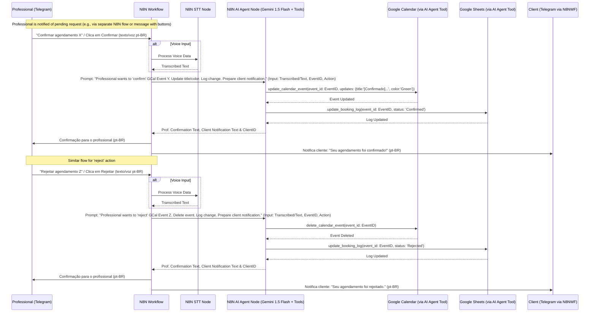

# Technical Specification: AgendAI - P1 (MVP) - N8N AI Agent Approach

 - **Version:** 1.8
 - **Date:** May 17, 2025
 - **Project:** AgendAI
 - **Author:** Frederico Policarpo Martins Boaventura

## 1. Introduction

This document outlines the technical design and implementation details for the P1 (MVP Essential) features of the AgendAI project. AgendAI is an intelligent virtual assistant for automating appointment scheduling. It leverages **N8N** for workflow automation, managing the Telegram bot interactions and orchestrating the AI Agent. The AI Agent is implemented using an **N8N AI Agent Node**, configured with **Gemini 1.5 Flash (via Vertex AI)** as its core intelligent engine and integrated with **Google Calendar and Google Sheets APIs as tools**. Speech-to-Text capabilities will be handled by a **dedicated N8N STT node**.

The P1 features focus on establishing the core scheduling lifecycle: professional availability setup, cancellation policy setup, client pre-booking requests (with voice/text input), professional confirmation/rejection, calendar updates, and basic agenda querying.

This specification adheres to the "Style Guide and Coding Conventions: AgendAI (Version 1.7)".

**Supported Language:** The primary language for all user interactions with AgendAI (including input via STT and chatbot responses) is **Brazilian Portuguese (pt-BR)**.

## 2. System Architecture Overview (P1)

The P1 system will consist of the following core components:

1.  **Client Interface (Telegram Bot):** Users (Professionals and Clients) interact with AgendAI via a Telegram bot, managed by an N8N workflow.
2.  **N8N Workflow:** Handles incoming messages from Telegram (via a Telegram Trigger node), manages conversation state, orchestrates calls to the STT Node and AI Agent Node, and sends responses back to Telegram.
3.  **Speech-to-Text (STT) Node (N8N):** A dedicated N8N node responsible for converting voice input (received from Telegram, in pt-BR) into text. This could be an official N8N "AI Speech to Text" node, a node for a specific STT service (e.g., Google Cloud STT, OpenAI Whisper), or a well-supported community node.
4.  **AI Agent (N8N AI Agent Node):**
    * Configured to use the **Gemini 1.5 Flash** model via Vertex AI.
    * Receives prompts, transcribed text (from the STT Node), and context from the N8N workflow.
    * Configured with **Google Calendar and Google Sheets as tools**. The schemas for these tools will be defined within the N8N AI Agent node's tool configuration.
    * Processes requests using Gemini 1.5 Flash, which can leverage the configured tools.
    * Returns the formatted response to the N8N workflow.
5.  **Gemini 1.5 Flash (via Vertex AI, accessed by N8N AI Agent Node):** Acts as the core intelligent engine.
6.  **Google Calendar API:** Accessed as a tool by Gemini (via the N8N AI Agent Node's tool configuration).
7.  **Google Sheets API:** Accessed as a tool by Gemini (via the N8N AI Agent Node's tool configuration).

**High-Level Interaction Flow (Example: Client Booking with Voice):**
Client (Voice in pt-BR on Telegram) -> Telegram API -> N8N Workflow (Telegram Trigger Node) -> **N8N STT Node (Transcribes Voice to Text)** -> N8N AI Agent Node (Prompt + Transcribed Text + Tool Config; Model: Gemini 1.5 Flash) -> [N8N AI Agent Node internally calls Gemini, Gemini uses configured tools] -> N8N AI Agent Node (Response from Gemini) -> N8N Workflow (Format Response, Send via Telegram Node) -> Telegram API -> Client (Response in pt-BR).

## 3. Mermaid Diagrams (P1 Flows)

### 3.1 High-Level System Architecture (N8N AI Agent Node with Gemini Tool Use & STT Node)

```mermaid
graph TD
    UserInterface["User (Client/Professional via Telegram)"] -- Text/Voice (pt-BR) --> TelegramAPI["Telegram API"];
    TelegramAPI -- Webhook --> N8N_Workflow["N8N Workflow (Orchestration)"];

    N8N_Workflow -- Voice Data (if any) --> N8N_STT_Node["N8N STT Node (e.g., Google STT, Whisper via N8N Node)"];
    N8N_STT_Node -- Transcribed Text --> N8N_Workflow;

    N8N_Workflow -- Prompt, Context, Transcribed Text/Text --> N8N_AIAgent_Node["N8N AI Agent Node (Gemini 1.5 Flash + Tools Config)"];

    N8N_AIAgent_Node -- Uses Tool (Calendar API via N8N Tool Config) --> GoogleCalendarAPI["Google Calendar API"];
    N8N_AIAgent_Node -- Uses Tool (Sheets API via N8N Tool Config) --> GoogleSheetsAPI["Google Sheets API (Logging, Config)"];

    GoogleCalendarAPI -- Tool Response --> N8N_AIAgent_Node;
    GoogleSheetsAPI -- Tool Response --> N8N_AIAgent_Node;

    N8N_AIAgent_Node -- Agent Response (Text/Tool Result) --> N8N_Workflow;
    N8N_Workflow -- Formatted Response --> TelegramAPI;
    TelegramAPI -- Text/Voice Response (pt-BR) --> UserInterface;


### 3.2 Client Pre-Booking Request Flow (P1.3 Simplified - N8N AI Agent Node & Gemini Tool Use, with STT)

```mermaid
sequenceDiagram
    participant Client as Client (Telegram)
    participant N8NWF as N8N Workflow
    participant STTNode as N8N STT Node
    participant AIAgentNode as N8N AI Agent Node (Gemini 1.5 Flash + Tools)
    participant GSheetsTool as Google Sheets (via AI Agent Tool)
    participant GCalTool as Google Calendar (via AI Agent Tool)

    Client->>N8NWF: Solicita agendamento (texto/voz pt-BR)
    alt Voice Input
        N8NWF->>STTNode: Process Voice Data
        STTNode-->>N8NWF: Transcribed Text
    end
    N8NWF->>AIAgentNode: Prompt: "Get valid day/period preferences for Prof X & policy" (Input: Transcribed/Text)
    AIAgentNode->>GSheetsTool: read_professional_config_sheet(prof_id, 'availability_pattern')
    GSheetsTool-->>AIAgentNode: Availability Pattern
    AIAgentNode->>GSheetsTool: read_professional_config_sheet(prof_id, 'cancellation_policy')
    GSheetsTool-->>AIAgentNode: Cancellation Policy
    AIAgentNode-->>N8NWF: Valid Day/Period Options & Policy Text
    N8NWF->>Client: Pergunta preferência de dia/período (opções válidas), Informa política

    Client->>N8NWF: Informa preferência (e.g., "Terça de manhã")
    alt Voice Input
        N8NWF->>STTNode: Process Voice Data
        STTNode-->>N8NWF: Transcribed Text
    end
    N8NWF->>AIAgentNode: Prompt: "Find available slots for Prof X on 'Terça de manhã'" (Input: Transcribed/Text)
    AIAgentNode->>GSheetsTool: read_professional_config_sheet(prof_id, 'availability_pattern')
    GSheetsTool-->>AIAgentNode: Availability Pattern
    AIAgentNode->>GCalTool: list_calendar_events(prof_id, date_range_for_preference) / get_calendar_free_busy(...)
    GCalTool-->>AIAgentNode: Busy/Free Slots
    AIAgentNode-->>N8NWF: Available specific slots
    N8NWF->>Client: Oferece horários específicos

    Client->>N8NWF: Escolhe horário (e.g., "10:00")
    alt Voice Input
        N8NWF->>STTNode: Process Voice Data
        STTNode-->>N8NWF: Transcribed Text
    end
    N8NWF->>AIAgentNode: Prompt: "Create PENDING GCal event for Client Y, Prof X at 'Terça 10:00'. Log it." (Input: Transcribed/Text)
    AIAgentNode->>GCalTool: create_calendar_event(details: {title:'[Pendente]...', color:'Orange', ...})
    GCalTool-->>AIAgentNode: Event Created (EventID)
    AIAgentNode->>GSheetsTool: append_booking_log(details: {status:'Pending', event_id: EventID, ...})
    GSheetsTool-->>AIAgentNode: Logged
    AIAgentNode-->>N8NWF: Pre-booking Confirmation Text
    N8NWF->>Client: Confirmação de envio do pré-agendamento (pt-BR)
```

### 3.3 Professional Confirmation/Rejection Flow (P1.4 & P1.5 Simplified - N8N AI Agent Node & Gemini Tool Use, with STT)



## 4. Detailed Design for P1 Functionalities
The N8N AI Agent Node will be the central point for AI-driven logic. Voice input will first be processed by a dedicated N8N STT Node. Prompts will be carefully crafted and supplied to the AI Agent node.

**General N8N Workflow, STT Node, and AI Agent Node Workflow for P1 Features:**
1.  N8N workflow is triggered by an incoming Telegram message (Telegram Trigger Node).
2.  If the message contains voice input, it's routed to the **N8N STT Node**. This node processes the audio and outputs the transcribed text. The language should be configured to pt-BR.
3.  The N8N workflow takes the original text message or the transcribed text from the STT Node and prepares inputs for the **N8N AI Agent Node**. This includes:
    * The user's message (as text).
    * A system prompt for the AI Agent Node.
    * Relevant context.
    * Ensuring correct tools (Google Calendar, Google Sheets) are enabled and authenticated.
4.  The **N8N AI Agent Node** processes the input using Gemini 1.5 Flash.
5.  The AI Agent Node outputs the result from Gemini.
6.  The N8N workflow receives this output, formats the final message, and sends it via a Telegram Sender Node.

---

### P1.1: Professional's Initial Availability Setup
*(PRD Ref: P1, Funcionalidade 1)*

* **N8N Workflow Design:**
    * Trigger: Telegram message.
    * Nodes: Telegram Trigger -> **N8N STT Node (if voice input)** -> **N8N AI Agent Node (for P1.1)** -> Telegram Sender.
* **N8N STT Node:** Converts voice to text if applicable.
* **N8N AI Agent Node (for P1.1):**
    * **Model:** Gemini 1.5 Flash.
    * **Input/Prompt Engineering:**
        * System Prompt: "You are AgendAI... Parse their availability details (from the provided text)..."
        * User Message: \[Text from Telegram or transcribed text from STT Node]
    * **Tools Configured:** `update_professional_config_sheet`.
    * **Expected Output:** Text like "Ótimo! Sua disponibilidade foi configurada..."

---

### P1.2: Professional's Cancellation Policy Setup
*(PRD Ref: P1, Funcionalidade 2)*

* **N8N Workflow Design:** Telegram Trigger -> **N8N STT Node (if voice)** -> **N8N AI Agent Node (for P1.2)** -> Telegram Sender.
* **N8N STT Node:** Converts voice to text.
* **N8N AI Agent Node (for P1.2):**
    * System Prompt: "You are AgendAI... Use 'update_professional_config_sheet' to store the policy (details from provided text)..."
    * User Message: \[Text/Transcribed text, e.g., "24 horas antes, taxa de 50 reais"]
    * Tools: `update_professional_config_sheet`.

---

### P1.3: Client's Pre-Booking Request
*(PRD Ref: P1, Funcionalidade 3)*

* **N8N Workflow Design (Multi-turn):** Each turn involving user input will pass through the STT Node if the input is voice.
    * Turn 1: Telegram Trigger -> **STT Node** -> **AI Agent Node (Step 1)** -> Telegram Sender.
    * Turn 2: Telegram Trigger -> **STT Node** -> **AI Agent Node (Step 2)** -> Telegram Sender.
    * Turn 3: Telegram Trigger -> **STT Node** -> **AI Agent Node (Step 3)** -> Telegram Sender.
* **N8N AI Agent Node (Steps 1, 2, 3):** Will receive transcribed text if the original input was voice. Prompts and tool usage remain as previously defined, operating on the textual input.

---

### P1.4: Professional's Pre-Booking Management (Confirmation/Rejection)
*(PRD Ref: P1, Funcionalidade 4)*

* **N8N Workflow Design:** Telegram Trigger (command/button) -> **STT Node (if command is voice)** -> **N8N AI Agent Node (for P1.4)** -> Telegram Sender.
* **N8N AI Agent Node (for P1.4):** Receives textual command (original or transcribed).

---

### P1.5: Update Agenda & Notify Client of Outcome
*(PRD Ref: P1, Funcionalidade 5)*
* No direct change, as this is triggered by P1.4's output.

---

### P1.6: Professional's Simple Agenda Query
*(PRD Ref: P1, Funcionalidade 6)*

* **N8N Workflow Design:** Telegram Trigger -> **STT Node (if voice)** -> **N8N AI Agent Node (for P1.6)** -> Telegram Sender.
* **N8N AI Agent Node (for P1.6):** Receives textual query.

---

## 5. Data Models (P1 Specific)
* No changes from version 1.7. Tool Schemas, Google Sheets structure, and Calendar Event structure remain the same.

## 6. Authentication and Authorization
* **N8N STT Node:** Will require its own authentication if it calls an external STT service (e.g., API key for Google STT). This should be managed via N8N's credential system.
* Other authentication aspects (Telegram, AI Agent to Gemini, Tools to Google APIs via OAuth) remain as per version 1.7.

## 7. Error Handling Strategy (P1)
* **N8N STT Node:** The workflow must handle potential errors from the STT Node (e.g., audio too noisy, service unavailable). This might involve asking the user to repeat or type their message.
* Other error handling aspects remain as per version 1.7.

## 8. Logging Strategy (P1)
* **N8N STT Node:** Logs from this node (e.g., success/failure of transcription, possibly confidence scores if available) should be captured in N8N Execution Logs.
* Other logging aspects remain as per version 1.7.

## 9. Deployment Considerations (P1)
* **N8N STT Node Configuration:**
    * Ensure the chosen STT node is correctly installed/available in the N8N instance.
    * Configure it for Brazilian Portuguese (pt-BR).
    * Set up any necessary authentication credentials for the STT service it uses.
* Other deployment aspects remain as per version 1.7.

## 10. Assumptions and Dependencies (P1)
* A suitable N8N STT node (official or community) is available and functions reliably for Brazilian Portuguese.
* Other assumptions remain as per version 1.7.

## 11. Test Scenarios (P1)
* **STT Node Functionality:** Add specific test cases for voice inputs:
    * Clear voice input in pt-BR is accurately transcribed.
    * Handling of unclear/noisy voice input.
    * Error messages if STT fails.
* All existing P1.x scenarios should be tested with both text and voice inputs (where applicable) to ensure the STT Node integrates correctly with the overall flow.
* Other test areas remain as per version 1.7.

*(Refer to Product Specification: AgendAI v1.0 for PRD references and detailed functional requirements.)*
